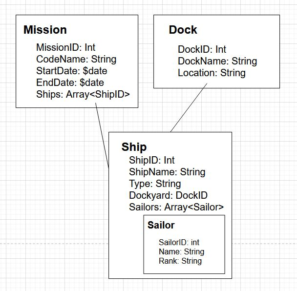

# KN02

## A


Originaldatei: models.drawio
### Explanation
A mission has one or more ships involved.
A dock holds and supplies one or more ships.
A ship has one or more sailors assigned.


## B


Originaldatei: models.drawio
### Explanation
mission - one to many - ship --> ships array embed into mission
dock - one to many - ship --> ships array embed into dock
ship - one to many - sailor --> sailors array embed into ship


## C

```
use('US_Navy_Desert_Storm');
db.createCollection("missions");
db.createCollection("docks");
db.createCollection("ships");
db.createCollection("sailors");
```
