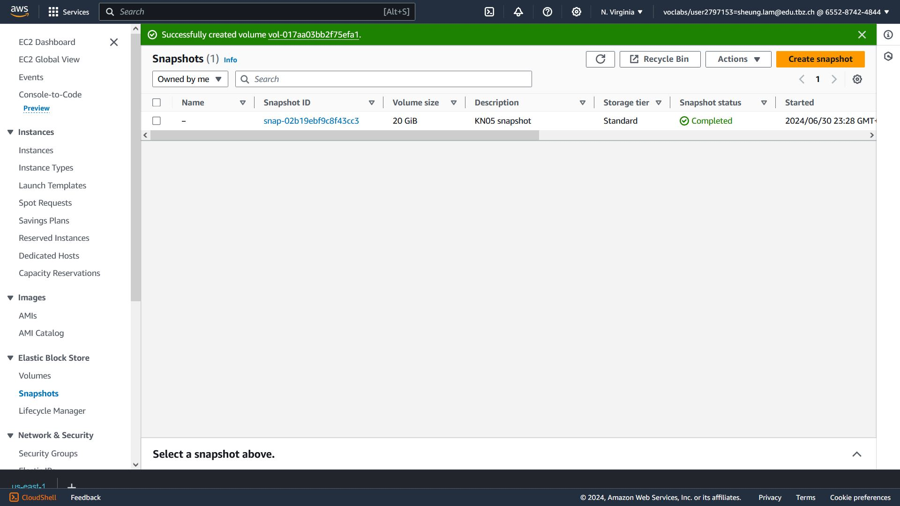
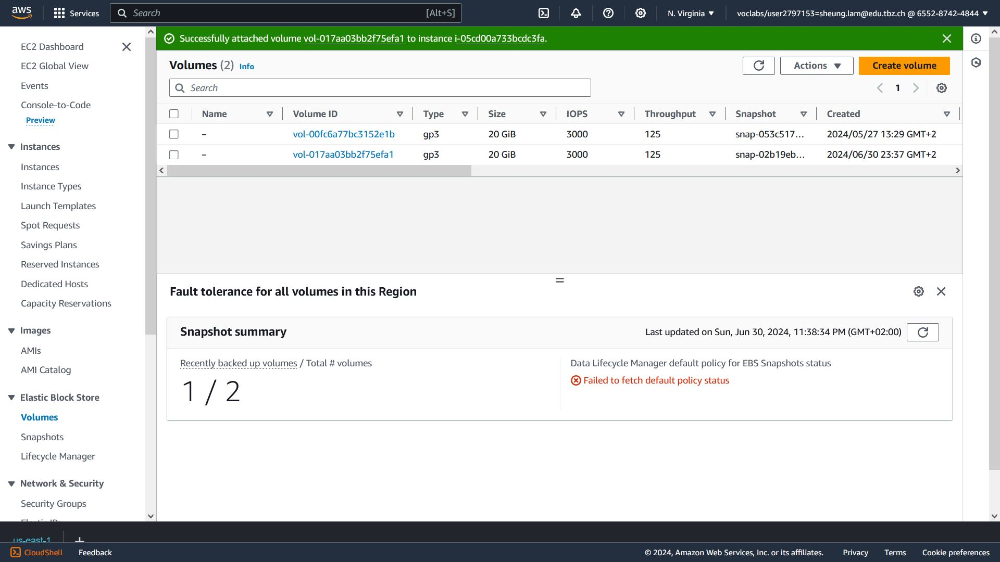

# A Rechte und Rollen


Authsource mit einer anderen DB funktioniert nicht.


(Benutzte DB)

### Benutzer erstellen:


### Benutzer 1 (obama)


#### Operationen: 


### Benutzer 2 (bush)


#### Operationen:


# B Backup und Restore

## SNAPSHOT

#### snapshot erstellen


#### drop collection


#### volume erstellen und attach




#### daten zurueck


## MONGODUMP

#### Dump erstellen


#### DB loeschen


#### mongorestore


#### DB zurueck


# Skalierung

### replication
```
Daten zu anderen DBs kopieren.
Wenn Hauptdatenbank absturzt, haben sekundaere DBs immer noch Daten.
Secundaere DBs koennen auch gelesen werden
Ist wie ein aktives Backup.
```


### sharding
```
Daten auf verschiedene Servers geteilt speichern.
Man kann einfach mehr Kapazitaet bekommen indem man mehr Servers einsetzt.
Queries werden schneller parallel bearbeitet.
```

