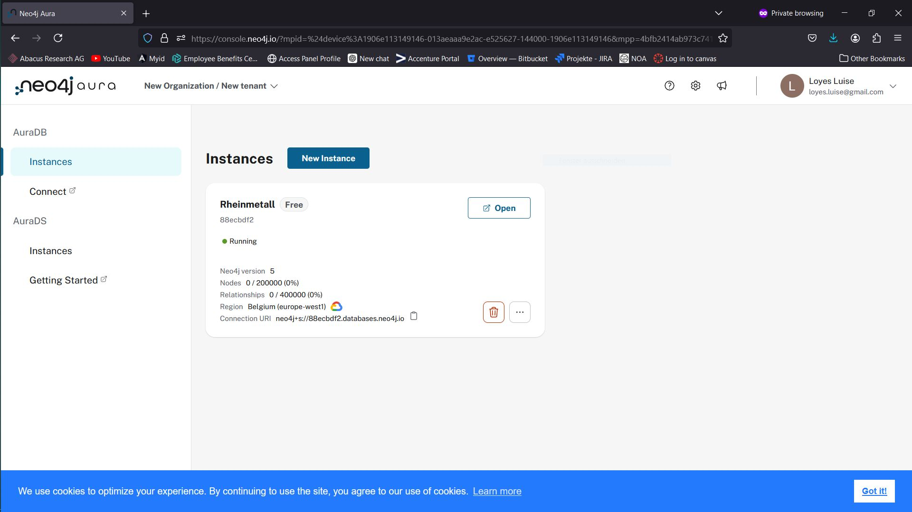
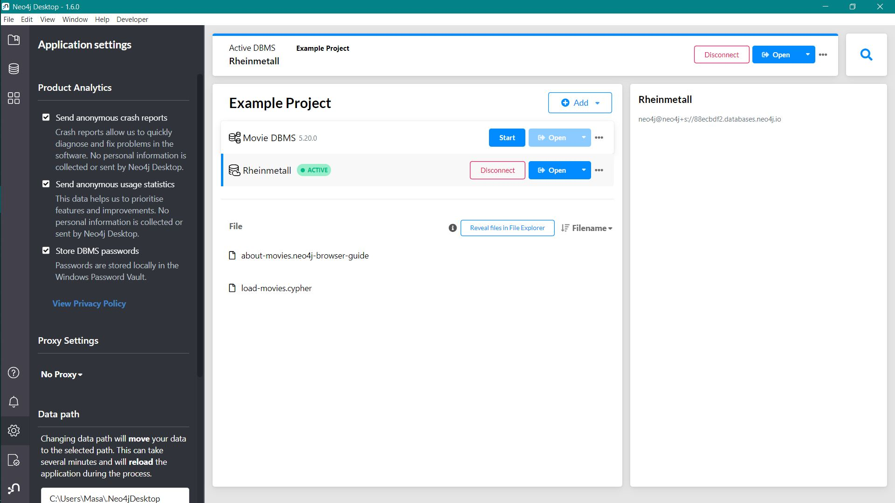
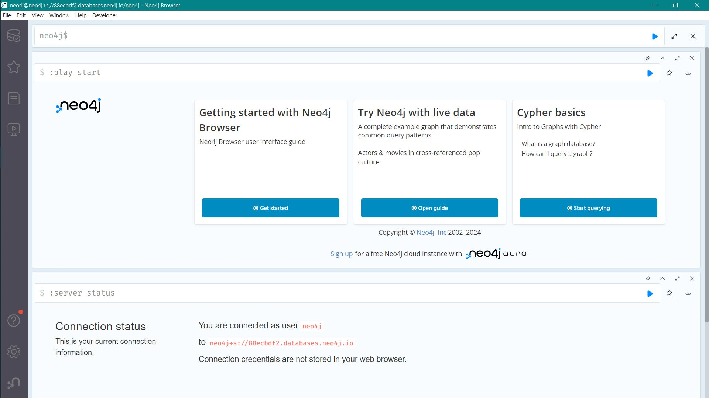
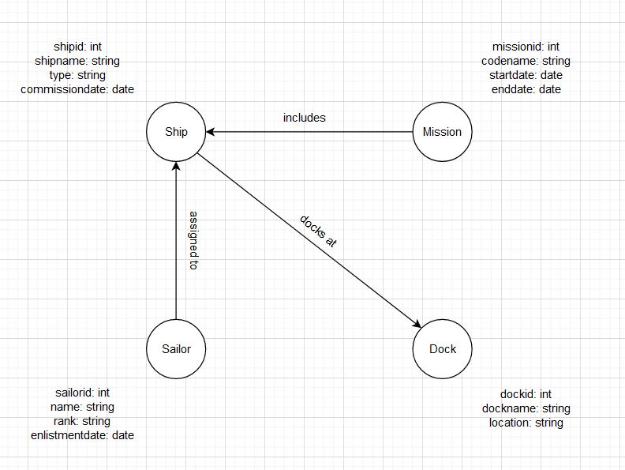

# Installation / Account erstellen



Ich konnte hier mich local anmelden und mit dem Instanz verbinden





# Logisches Modell



```
Eine Mission beinhaltet mehrere Schiffe.
Ein Schiff kann als Flagship in einer Mission dienen.

Ein Schiff ist in genau einer werft parkiert.

Ein Seemann dient auf einem Schiff.
Ein Seemann kann auch als Kapitaen des Schiffs dienen.

```
