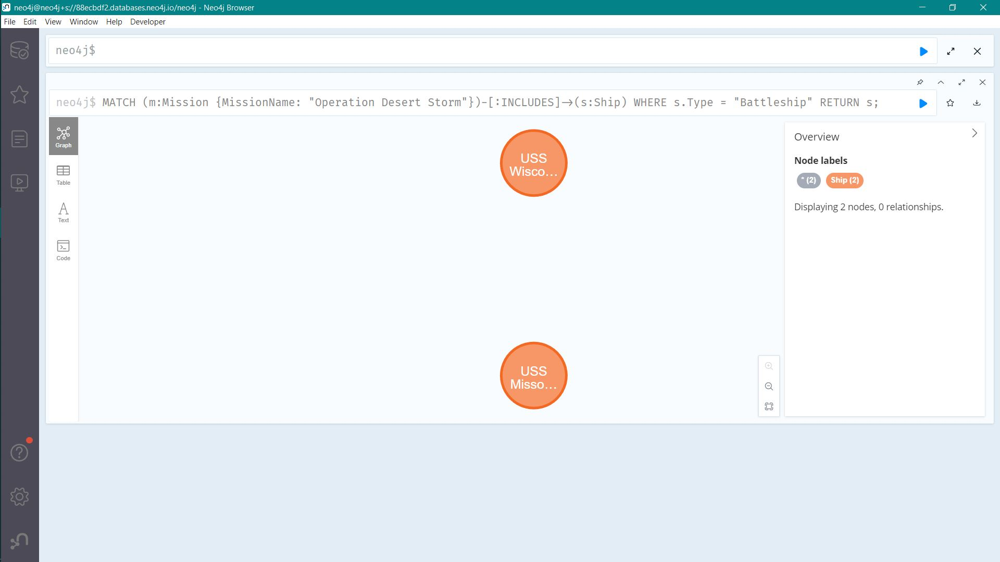
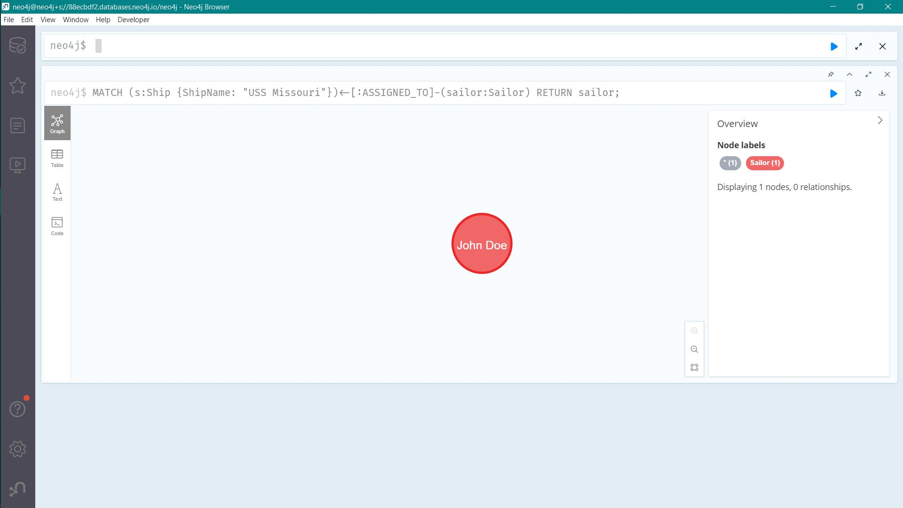
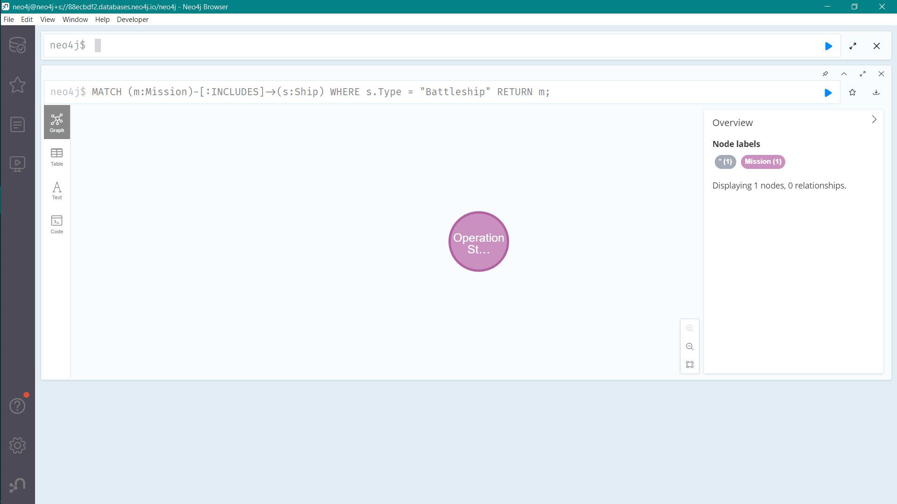
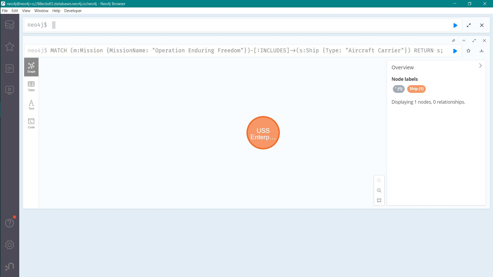

# A Daten hinzufuegen
[script](a.txt)


# B Daten abfragen

### Statement zum alle Knoten und Kanten lesen
```
MATCH (n)-[r]->(m) RETURN n;
```
#### Dieses Statement sucht und returns alle patterns, die alle Verbindingen die wie (Knoten)-[Kanten]->(Knoten auf der anderen Seite) aussehen.

### optional match
```
MATCH (n) OPTIONAL MATCH (n)-[r]->(m) RETURN n, r, m;
```
#### Dieses Statment sucht alle patterns wie (n)-[r]->(m), returns aber trotzdem alle Knoten und Kanten auch wenn solche Kanten nicht existieren.


## Szenarien:
### Alle Schiffe returnen, die in der Mission Desert Storm beteilligt sind
```
MATCH (m:Mission {MissionName: "Operation Desert Storm"})-[:INCLUDES]->(s:Ship) WHERE s.Type = "Battleship" RETURN s;
```


### Alle Sailors returnen, die auf USS Missouri sind
```
MATCH (s:Ship {ShipName: "USS Missouri"})<-[:ASSIGNED_TO]-(sailor:Sailor) RETURN sailor;
```


### Alle Missionen returnen, die Battleships involviert sind
```
MATCH (m:Mission)-[:INCLUDES]->(s:Ship) WHERE s.Type = "Battleship" RETURN m;
```


### Alle Aircraft Carriers returnen die in der Mission Enduring Freedom involviert sind
```
MATCH (m:Mission {MissionName: "Operation Enduring Freedom"})-[:INCLUDES]->(s:Ship {Type: "Aircraft Carrier"}) RETURN s;
```

